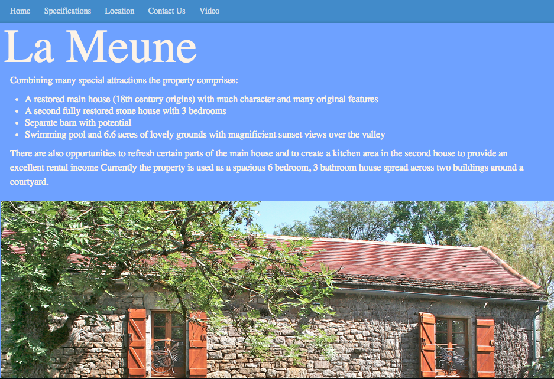

LaMeune
=======

##Objectives

To make a static website for a friend, whilst revising Sinatra, HTML, CSS and cucumber testing. 

##Technologies

    * Ruby 2.0.0
    * Cucumber
    * Sinatra
    * HTML
    * CSS
    * Twitter Bootstrap

##Website:

http://lameune.herokuapp.com/

##How to test it

	* git clone https://github.com/tbeeley/LaMeune.git
	* cd LaMeune 
	* bundle
	* cucumber 

